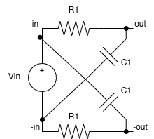
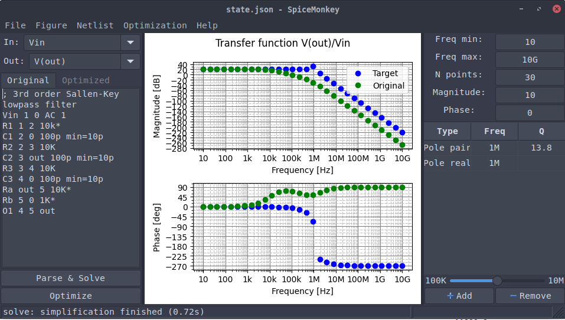
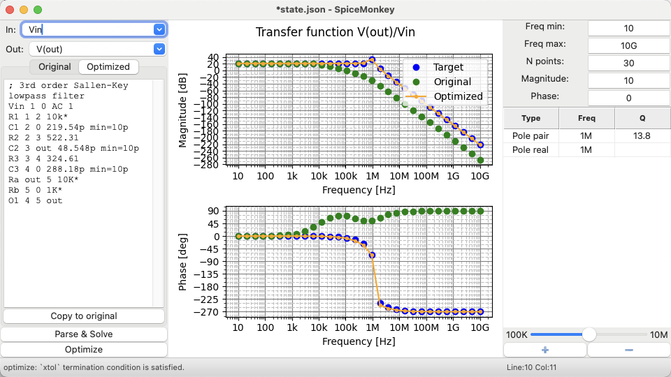
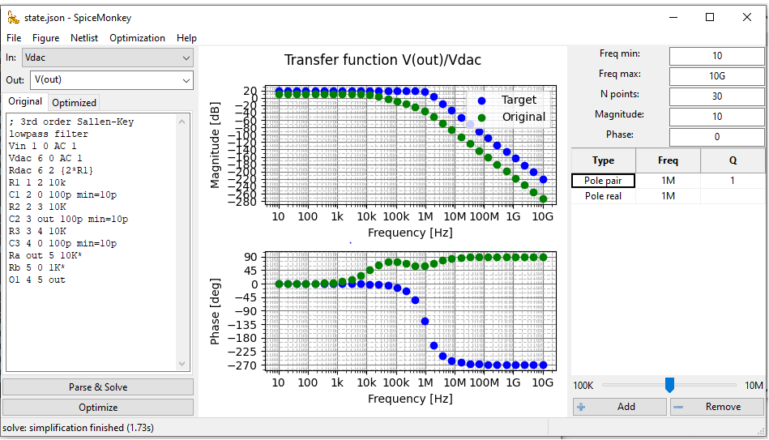

# SpiceMonkey

A self-contained circuit analysis and optimization toolbox.

It takes a SPICE-like description of a circuit, uses Modified Nodal Analysis (MNA) to find the transfer function in the Laplace domain using symbolic expressions (sympy) and it uses least-squares to optimize the elements until we get a desired frequency response.

It has a GUI based on wxPython that is multiplatform (tested on Windows, Linux and MacOS).

This is meant to be a "table-top" tool running on lab PCs to help you understand your circuit better while you are building it on the protoboard.

For bug reporting and feature ideas use GitHub "Issues".

# Features

The core of the program has three main components:

- A SPICE-like netlist parser that takes a circuit description and creates the symbolic circuit matrices using MNA.
- A "target transfer function" generator, that takes a description of the poles and zeros of the desired frequency response and evaluates the transfer function over a predefined frequency range.
- A least-squares optimization algorithm that iteratively changes the values of the circuit elements, substitutes them on the symbolic expressions obtained from MNA, and tries to match the circuit frequency response with the desired one.

## SPICE-like netlist parser
- SPICE-like netlist syntax with some extensions.
- It has been validated by comparing against ngspice and ltspice when possible (test_netlists subfolder).
- Comments start with ``;`` character.
- Supported circuit elements:
  - Passives: resistor (R), capacitor (C), inductor (L)
  - Coupled inductors (K)
  - Ideal transformer (T) works also at DC
  - Controlled sources (E, F, G and H)
  - Ideal opamp (O)
  - Fixed voltage and current sources (V, I)
- Node names can be strings. Node 0 is always ground:
  
  
  ``` 
  Vin in 0 1 AC 1
  R1 in out 10K
  C1 out 0 100n 
  ```
- __Custom extension (Experimental):__ Adding a minus sign (-) before a node name refers to the cross-connected node in a balanced 
(fully-differential) circuit. This allows simulating fully-differential circuits by using only the single-ended
equivalent circuit, which is faster because it uses less equations:
  
  
  ``` 
  Vin in 0 1 AC 1
  R1 in out 10K
  C1 out -in 100n 
  ```
## Circuit optimization options
- Circuit elements with an asterisk (*) in their value are fixed and not changed during optimization:
``` R1 node1 node2 10K* ```
- Circuit elements can have a value based on an expression of other circuit elements:
``` R2 node2 node3 {R1*2} ```
- Each circuit element has a globally-defined minimum and maximum value, can be overriden per-component with the (max=) and (min=) arguments in the netlist.
``` C1 node1 node2 10p min=1p max=100p ```
- Logarithmic search: The optimization algorithm changes the values of the components in logarithmic steps (ie. 1k, 3k, 10k) instead of linear steps (ie. 1k, 2k, 3k) on each optimization step to mimic the behavior of a "real engineer".

# Screenshot (Linux)



# Screenshot (MacOS)



# Screenshot (Windows)



# Setup instructions 

In general:
1. Install at least Python 3.13 or newer
2. Install all the required Python libraries: `pip install -r requirements.txt`
3. Run `python main.py` in your terminal to launch the GUI
4. Optional command-line arguments:
```
usage: main.py [-h] [-b] [-t] [-v] [statefile]

A self-contained Python tool to simulate and optimize AC electrical circuits.

positional arguments:
  statefile      Load state from JSON file (default: ./state.json)

options:
  -h, --help     show this help message and exit
  -b, --batch    Run in batch mode without GUI
  -t, --test     Run tests
  -v, --verbose  Print all debug messages
```

## MS Windows

## MacOS

## Linux

# History of the project

The main concept comes from a homework excercise for a MATLAB course during my bachelor's degree back in 2016.
Over the years, I have been using the idea (MNA combined with least-squares) to understand better existing circuits
and to come up with new ones. Since I found this app useful to myself, I thought that it might be useful for other
people too, and I made it my hobby project to create a self-contained app.

My goals for this project are:

- Find a way to create native-GUI apps that run on Linux, MS Windows and MacOS, without recurring to a web interface.
- Understand how circuit simulators work (Modified Nodal Analysis).
- Translate a concept in MATLAB into a self-contained fully open source app.
- Learn more about coding in Python.
- Learn how GitHub works and how open-source software development in a community works.

# Useful references

- **Farid N. Najm - Circuit Simulation** - Wiley-IEEE Press (2010)
  A good introductory book to Modified Nodal Analysis (MNA).
  Errata for the book: https://www.eecg.utoronto.ca/~najm/simbook/errata.pdf
- **Jiri Vlach and Kishore Singhal - Computer methods for circuit analysis and design** - Van Nostrand Reinhold Company (1983).
  Deeper concepts on MNA.
- **Series of video tutorials about MNA - Shanthi Pavan** (IIT Madras):
  https://www.youtube.com/watch?v=43eM-axd1mU
- **Implementation of MNA in MATLAB** (Swarthmore College):
  https://lpsa.swarthmore.edu/Systems/Electrical/mna/MNA6.html
- **SLICAP from TUDelft.** An implementation of MNA with symbolic expressions. It is not self-contained (requires Maxima CAS)
  https://analog-electronics.tudelft.nl/SLiCAP.html
- **Ahkab** A SPICE-like circuit simulator written in Python https://github.com/ahkab/ahkab

# License
```
SpiceMonkey: A self-contained circuit analysis and optimization toolbox
Copyright (C) 2024  Victor Pecanins-Martínez

This program is free software: you can redistribute it and/or modify
it under the terms of the GNU General Public License as published by
the Free Software Foundation, either version 3 of the License, or
(at your option) any later version.

This program is distributed in the hope that it will be useful,
but WITHOUT ANY WARRANTY; without even the implied warranty of
MERCHANTABILITY or FITNESS FOR A PARTICULAR PURPOSE.  See the
GNU General Public License for more details.

You should have received a copy of the GNU General Public License
along with this program.  If not, see <https://www.gnu.org/licenses/>.
```